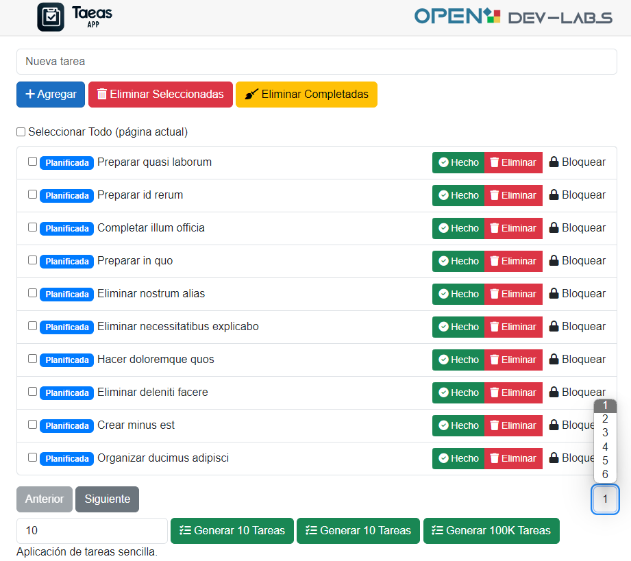

# Proyecto Tareas

### Curso Net Core 8



#### Requisitos de la APP de tareas

## App en Blazor > Soporte Auto (mixto)

Permita gestionar una lista de tareas (en memoria o en BDD)

- Añadir nueva tarea
- Eliminar tareas (Única / de forma múltiple)
- Controlar el estado de la tarea (planificada > iniciada > en curso > completada)
- Soporte a tareas bloqueadas
- Listar "Páginado" (100k)

Tiene que soportar 100k tareas.

### Requerimientos de la Interfaz de Usuario

Tenéis que construir la interfaz de usuario con las siguientes restricciones:

- Tiene que soportar el uso desde la web
- Tener en cuenta escenario futuro desde una app móvil (secundario)

---

#### Prioridad en las valoraciones

Orden/Sobreingeniería/Escalabilidad/Buena orientación en la arquitectura (interna)/Nivel de abstracción

#### A tener en cuenta

Antes de empezar, debes revisar algún ejemplo existente (GitHub o similar).
Podéis usar cualquier herramienta o ayuda (Devin/ChatGPT/Copilot).

## Prerrequisitos

Antes de ejecutar este proyecto, asegúrate de tener instalado:

- [.NET SDK](https://dotnet.microsoft.com/download) (versión 8.0 o superior)

## Ejecutar

Para ejecutar el programa, usa simplemente el comando desde la línea de comandos estando en el directorio del proyecto:

```bash
dotnet run
```

## Ejecutar migraciones para crear la base de datos

```bash
dotnet ef migrations add InitialCreate
dotnet ef database update
```

Ref: (https://learn.microsoft.com/en-us/ef/core/managing-schemas/migrations/?tabs=dotnet-core-cli)

Puede ser que no tengas la herramienta para utilizarlo por línea de comandos.

Yo no la tenía instalando EF, al instalar Net Core SDK 8, ni Visual Staudio 2022.

```bash
dotnet tool install --global dotnet-ef
```

### Problemas conocidos

- Los Checkboxes marcados en la lista de TodoItem para borrar tareas seleccionadas, permanecen marcados después de eliminar correctamente, esas tareas de forma visual.
- Implemente un select para cambiar entre pagina tipo PHPMyAdmin, que me gusta mucho, pero se regenera cada vez que lo pulso, debo hacer que solo se genere si cambia la cantidad de TodoItem.
- ~~El proceso de generar TodoItem inventados para pruebas, debería mejorarlo, que lo haga por lotes y no todos a la vez, por si me pide 100k que no quede esperando unos minutos mientras la Task termina. Que muestre por paquetes y así el usuario ve cómo la tarea se está haciendo.~~ Arreglada la tarea que tardaba mucho, ya es un segundo aprox.
- Terminar la vista de Base de datos
- Crear un parametro en Componente Todo para pasarle si va a funcionar por memoria o por DB Context

## Licencia

Este proyecto está licenciado bajo la Licencia MIT - ver en (https://es.wikipedia.org/wiki/Licencia_MIT) para más detalles.
